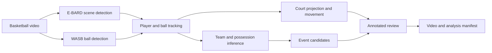

<div align="center">

# CourtVision

**Evidence-first basketball video analysis—from raw footage to an annotated, timecoded review.**

[](https://github.com/jcshyy/CourtVision/actions/workflows/tests.yml)


[Web client](web/README.md) · [Validation report](docs/validation-report.md) · [AWS deployment](deploy/aws/README.md)

</div>

CourtVision is an offline basketball-video analysis pipeline with a public
live-analysis web application. It detects and tracks players and the ball, estimates teams
and possession, projects player positions onto a tactical court, identifies
timecoded event candidates, and renders an annotated review video.

> [!IMPORTANT]
> CourtVision produces **experimental analysis, not verified game statistics**.
> It deliberately leaves teams, possession, and events unknown when the visual
> evidence is weak.

## What it does

| Capability | Output |
| --- | --- |
| Player, referee, hoop, and ball detection | Frame-level detections with persistent player tracks |
| Team assignment | Confidence-aware team identities inferred from multi-frame jersey evidence |
| Possession analysis | Ball-holder and team-control timelines with explicit unknown states |
| Event detection | Timecoded `pass`, `interception`, and `shot_attempt` candidates |
| Tactical projection | Player positions mapped onto a 2D basketball court |
| Movement analysis | Estimated player speed and distance |
| Review artifacts | Annotated MP4 video and an optional JSON analysis manifest |

Shot attempts expose trajectory evidence only. The public analysis contract
does not claim make/miss, rebound, dead-ball, or putback outcomes.

## How it works



The default runtime performs one shared E-BARD pass for players, referees,
hoops, and semantic basketball candidates, then fuses those basketball
candidates with WASB. Confidence-aware filters reject short, mixed, distant,
and referee-contaminated jersey tracks instead of forcing a team assignment.

## Quick start

### 1. Install the runtime

CourtVision currently targets Python 3.14. From the repository root:

```powershell
python -m venv .venv
.\.venv\Scripts\python.exe -m pip install -r backend\requirements.txt
```

### 2. Add model weights

Runtime weights are intentionally excluded from Git. Place the following files
in `backend/models/`:

| File | Purpose |
| --- | --- |
| `ebard_yolov8n.pt` | Players, referees, hoops, and basketball candidates |
| `wasb_basketball_torchscript.pt` | Basketball detection |
| `yolo11n-pose.pt` | Player pose estimation |
| `court_keypoint_detector.pt` | Court keypoint detection |

The pinned NBA-trained E-BARD checkpoint can be installed automatically:

```powershell
.\.venv\Scripts\python.exe scripts\prepare_ebard_model.py
```

See [`backend/models/README.md`](backend/models/README.md) for the pinned source,
license, and checksum details.

### 3. Verify the environment

```powershell
.\.venv\Scripts\python.exe scripts\check_runtime.py --check-models --check-ebard
.\.venv\Scripts\python.exe -m unittest discover -s tests -v
```

### 4. Analyze a video

```powershell
.\.venv\Scripts\python.exe main.py input_videos\video_1.mp4 `
  --output-video output_videos\video_1.mp4 `
  --output-analysis output_videos\video_1.json
```

If automatic jersey discovery is uncertain, the process exits with status 2
and returns `needs_team_colors`. Retry with two distinct primary jersey colors:

```powershell
.\.venv\Scripts\python.exe main.py game.mp4 `
  --team-1-color "#FFFFFF" --team-2-color "#C8102E"
```

The colors guide team prototypes; they do not bypass crop rejection or force
unknown players onto a team.

For a bounded segment of a longer upload:

```powershell
.\.venv\Scripts\python.exe main.py game.mp4 `
  --start-seconds 60 --duration-seconds 15 `
  --target-fps 30 --max-width 1280 `
  --output-video output_videos\game_s60_d15.mp4
```

Run `python main.py --help` to see analysis-only, event-only, detector, and shot
trajectory options.

## Browser review experience

Preview the dependency-free static client without AWS credentials:

```powershell
python -m http.server 8765 -d web
```

Then open:

- `http://127.0.0.1:8765/` for the landing page;
- `http://127.0.0.1:8765/demo.html` for the permanent preprocessed sample; or
- `http://127.0.0.1:8765/app.html?demo=review` for a synthetic review state.

The authenticated client lives at `app.html`. Other local interface fixtures
are available through `?demo=signin`, `upload`, `processing`, `colors`, or
`error`.

To run the real local upload-to-review workflow:

```powershell
.\.venv\Scripts\python.exe scripts\check_runtime.py --check-models
.\.venv\Scripts\python.exe -m backend.app.local_demo
```

This opens `http://127.0.0.1:8080/`, stores jobs under `runs/local_demo`, and
processes one upload at a time with the local models. CPU-only analysis can be
slow. See the [local demo guide](deploy/local/README.md) for limits and runtime
behavior.

## Evaluation and diagnostics

CourtVision separates detector coverage checks from ground-truth evaluation.
Coverage reports are useful diagnostics, but are not presented as accuracy
measurements.

Compare the current and E-BARD scene detectors on identical sampled frames:

```powershell
.\.venv\Scripts\python.exe scripts\compare_player_detectors.py `
  input_videos\video_1.mp4 --duration-seconds 10 --target-fps 10
```

Reproduce E-BARD's held-out FashionCLIP jersey-color benchmark:

```powershell
.\.venv\Scripts\python.exe scripts\prepare_ebard_team_dataset.py
.\.venv\Scripts\python.exe scripts\evaluate_ebard_fashionclip.py
```

Run the ground-truth object-detection benchmark on E-BARD's physical `test`
split:

```powershell
.\.venv\Scripts\python.exe scripts\prepare_ebard_detection_dataset.py
.\.venv\Scripts\python.exe scripts\evaluate_ebard_detection.py
```

Downloaded CC BY 4.0 datasets are stored in gitignored `benchmarks/`
directories, and evaluation reports are written under gitignored `runs/`
directories. The [E-BARD integration notes](docs/ebard-integration.md) document
pinned asset hashes, measured results, limitations, and deployment settings.
The repository also includes a [versioned CourtVision benchmark](benchmarks/courtvision_v1/README.md)
and an [NBA-weighted sealed holdout protocol](benchmarks/courtvision_nba_holdout_v1/README.md).

For explicit legacy comparisons, the former large YOLO checkpoints remain
available behind detector flags:

```powershell
.\.venv\Scripts\python.exe main.py input_videos\video_1.mp4 `
  --scene-detector-backend current --ball-detector-backend hybrid `
  --output-video output_videos\video_1-legacy.mp4
```

## Deployment

The [AWS reference stack](deploy/aws/README.md) provides a bounded deployment path
with Cognito email-and-password accounts, direct temporary uploads, a shared
Lambda API handler, and a scale-to-zero AWS Batch GPU environment. Its initial
limits—30 seconds, 30 FPS, 1280 px, and 24-hour retention—are configuration,
not application structure. An opt-in Flask/Fargate control plane remains
available for sustained traffic.

Model weights are not baked into the batch-worker image. AWS jobs download them
from a private model bucket; non-AWS runtimes can mount them at
`/app/backend/models`. Do not expose `main.py` directly as a multi-user service:
authentication, queuing, upload scanning, retention, and resource isolation
belong in the hosting layer.

Additional deployment guides:

- [Local upload-to-review demo](deploy/local/README.md)
- [Flask control-plane adapter](deploy/flask/README.md)
- [Guarded single-job EC2 worker](deploy/ec2/README.md)

## Repository layout

```text
CourtVision/
├── backend/       Analysis modules, web API, Lambda handler, and models
├── benchmarks/    Versioned evaluation protocols and annotations
├── deploy/        AWS, EC2, Flask, and local deployment guides
├── docs/          Validation and model-integration notes
├── scripts/       Setup, evaluation, diagnostics, and data preparation
├── tests/         Unit and integration tests
├── web/           Static landing, upload, and evidence-review client
└── main.py        Command-line analysis entry point
```

## Known limitations

- Ball acquisition remains sensitive to false detections and nearby defenders.
- Possession, pass, interception, and shot-attempt outputs are candidates that
  require review against the source footage.
- The decoder currently materializes selected and rendered frames in memory and
  rejects selections estimated above 2 GiB.
- Production deployments still need platform-level limits for upload size,
  duration, concurrency, CPU/GPU time, disk usage, and cache retention.
- Model weights and uploaded footage are not included in the repository; users
  are responsible for the rights and licenses applicable to their assets.

See the dated [validation report](docs/validation-report.md) for measured sample
behavior, known failure modes, and the remaining release blocker.
